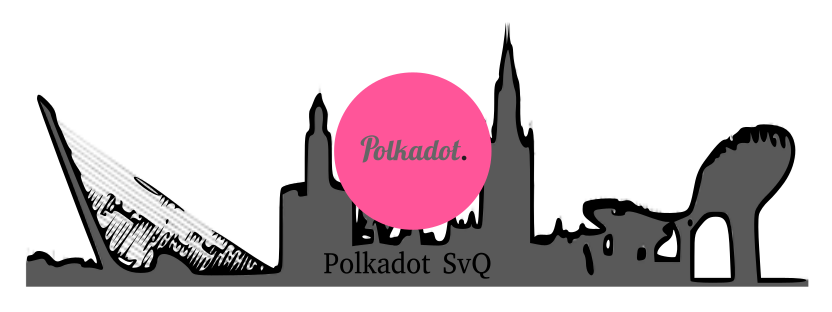

<h1 align="center">Polkadot</h1>

 

<h1 align="center">Software y documentación relativa al proyecto Polkadot</h1>

Toda la documentación aquí traducida puedes encontrarla en la <a href="https://github.com/w3f/polkadot-wiki">wiki oficial de Polkadot</a> o en su <a href="https://wiki.polkadot.network/en/latest/">página web</a>.

